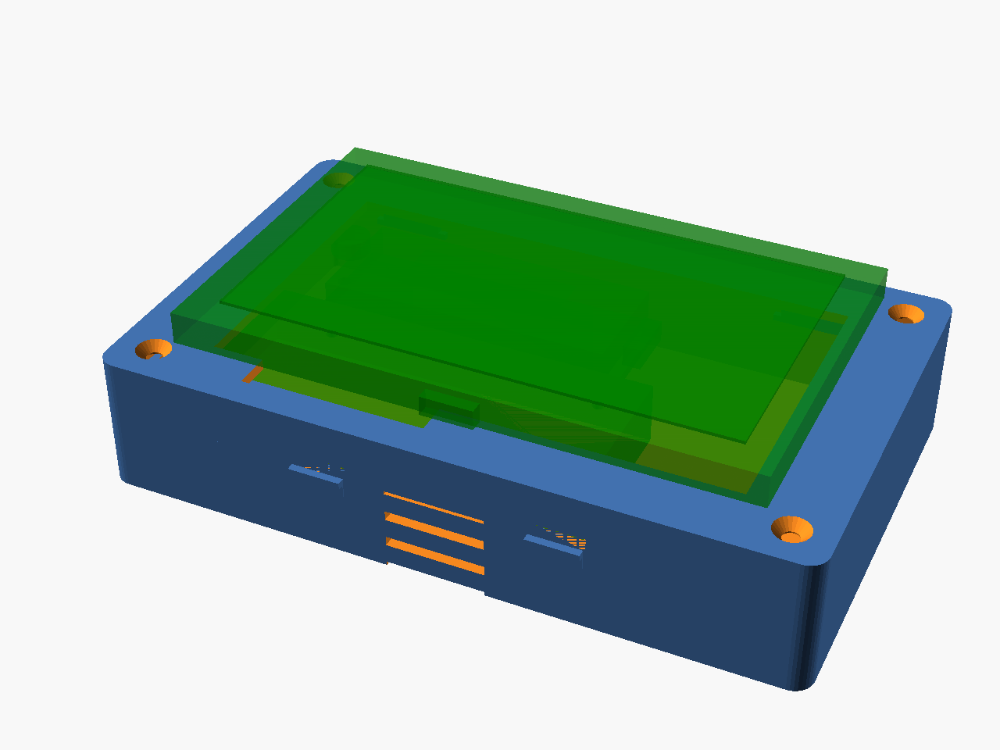
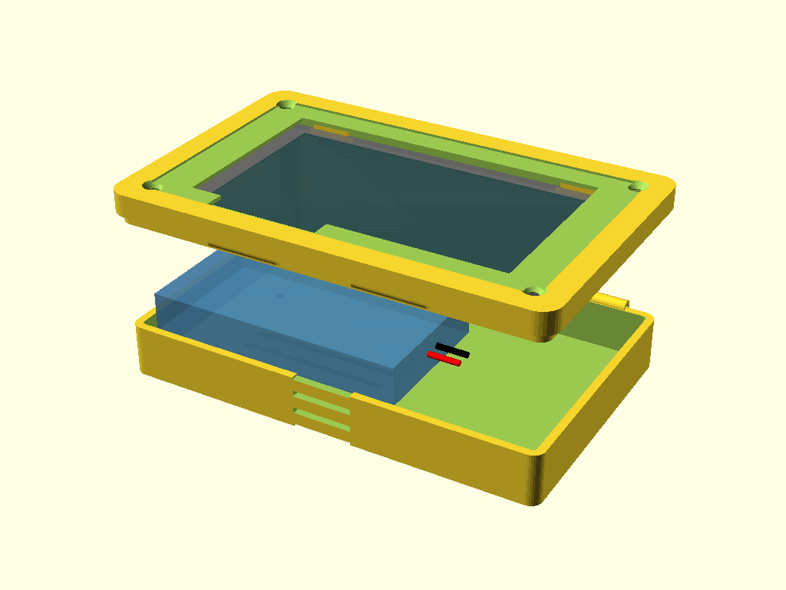
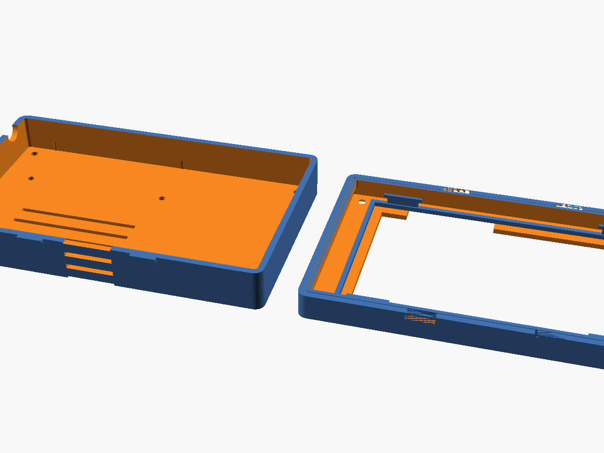

# Altoids Mesh Enclosure

A parametric, 3D-printable enclosure modeled after an Altoids tin, designed to house a complete Meshtastic communication node.

## Preview

### Assembled View


### Exploded View


### Print Layout


## Components

| Component | Dimensions (mm) | Description |
|-----------|-----------------|-------------|
| Heltec V4 (WiFi LoRa 32) | 52 × 25 × 7 | Meshtastic-compatible LoRa module with OLED display |
| M5Stack CardKB Unit 1.1 | 88 × 54 × 5 | Credit-card-sized QWERTY keyboard (I2C) |
| MakerFocus 3.7V 3000mAh | 65 × 36 × 10 | Lithium polymer rechargeable battery |
| 2 mm metal rod / music wire | ~80 length | Hinge pin for laptop-style lid |

## Enclosure Specifications

- **Style**: Altoids tin aesthetic with rounded corners
- **Wall thickness**: 2.0 mm (FDM-optimized)
- **Floor/ceiling**: 1.6 mm
- **Tolerance**: 0.3 mm general, 0.5 mm component fit
- **Closure**: Snap-fit latches with optional M2.5 screw mounting
- **Hinge**: Barrel-type knuckle hinge along back edge (laptop-style opening)
- **Material**: PLA, PETG, or ABS recommended

## Features

- **Laptop-style hinge** with barrel knuckles along the back edge so the lid opens like a laptop
- **Battery compartment** with retention clips and ventilation slots for heat dissipation
- **Heltec V4 mounting** with M2 standoffs and PCB alignment guides
- **CardKB integration** in the lid with support ledges and retention clips
- **OLED display window** in the lid, positioned above the Heltec screen
- **USB-C port cutout** for charging and data access
- **SMA antenna port** for external antenna connection
- **Internal antenna housing** channel with retention clips (plastic doesn't block RF)
- **Charging LED window** for visual status indication
- **Ventilation** on bottom and sides for thermal management
- **Cable routing channel** between battery and Heltec module
- **Snap-fit lid** with engagement lip for tool-free assembly
- **Corner screw bosses** for secure closure alternative

## File Structure

```
enclosure/
├── altoids_mesh_enclosure.scad   # Main assembly (open this first)
├── parameters.scad                # All configurable dimensions
├── components.scad                # Component models for visualization
├── bottom_case.scad               # Bottom case (battery + Heltec)
└── top_lid.scad                   # Top lid (CardKB + display window)
docs/
└── assembly_guide.md              # Step-by-step assembly instructions
stl/
└── .gitkeep                       # Export STL files here
```

## Quick Start

### Prerequisites

- [OpenSCAD](https://openscad.org/) (v2021.01 or later recommended)

### Viewing the Design

1. Open `enclosure/altoids_mesh_enclosure.scad` in OpenSCAD
   - **All `.scad` files in the `enclosure/` directory must remain together** for includes to resolve
2. Press **F5** for preview or **F6** for full render
3. Change `render_mode` variable:
   - `0` = Assembled (closed) view
   - `1` = Exploded view (default)
   - `2` = Print layout (parts flat on build plate)
   - `3` = Laptop open (lid hinged open)

### Exporting STL Files

1. Open `enclosure/bottom_case.scad` → **F6** → Export as STL → save to `stl/bottom_case.stl`
2. Open `enclosure/top_lid.scad` → **F6** → Export as STL → save to `stl/top_lid.stl`

### Customization

All dimensions are parametric. Edit `enclosure/parameters.scad` to adjust:

- Component dimensions (if using different parts)
- Wall thickness and tolerances
- Snap-fit vs screw mounting preferences
- Ventilation slot size and count

## Printing Guidelines

| Setting | Recommended Value |
|---------|-------------------|
| Layer height | 0.2 mm |
| Infill | 20–30% |
| Walls/perimeters | 3 |
| Top/bottom layers | 4 |
| Supports | Not required (designed support-free) |
| Material | PLA (easiest), PETG (stronger), ABS (heat resistant) |
| Orientation | Print each part with the flat face down |

## Assembly

See [docs/assembly_guide.md](docs/assembly_guide.md) for detailed step-by-step instructions.

## License

See [LICENSE](LICENSE) for details.
